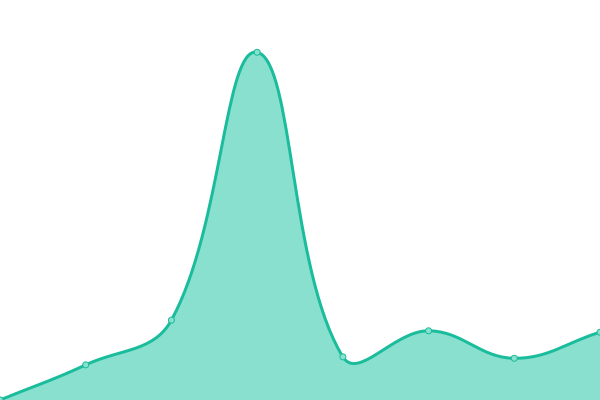

# [📈 Live Status](https://arnold-bunu.github.io/bnt-uptime): <!--live status--> **🟧 Partial outage**

This repository contains the open-source uptime monitor and status page for [Arnold Bunu](https://arnold-bunu.github.io/bnt-uptime), powered by [Upptime](https://github.com/upptime/upptime).

With [Upptime](https://upptime.js.org), you can get your own unlimited and free uptime monitor and status page, powered entirely by a GitHub repository. We use [Issues](https://github.com/arnold-bunu/bnt-uptime/issues) as incident reports, [Actions](https://github.com/arnold-bunu/bnt-uptime/actions) as uptime monitors, and [Pages](https://arnold-bunu.github.io/bnt-uptime) for the status page.

<!--start: status pages-->
<!-- This summary is generated by Upptime (https://github.com/upptime/upptime) -->
<!-- Do not edit this manually, your changes will be overwritten -->
<!-- prettier-ignore -->
| URL | Status | History | Response Time | Uptime |
| --- | ------ | ------- | ------------- | ------ |
|  [Bingo Nova Technology](https://www.bingonova.tech) | 🟩 Up | [bingo-nova-technology.yml](https://github.com/arnold-bunu/bnt-uptime/commits/HEAD/history/bingo-nova-technology.yml) | 

 567ms
     
 | 

<a href="https://arnold-bunu.github.io/bnt-uptime/history/bingo-nova-technology">99.82%</a>
    

|  [Cloud Cover IT](https://cloudcover.co.za) | 🟩 Up | [cloud-cover-it.yml](https://github.com/arnold-bunu/bnt-uptime/commits/HEAD/history/cloud-cover-it.yml) | 

 914ms
     
 | 

<a href="https://arnold-bunu.github.io/bnt-uptime/history/cloud-cover-it">99.83%</a>
    

|  [Lelia Schott](https://www.leliaschott.com) | 🟥 Down | [lelia-schott.yml](https://github.com/arnold-bunu/bnt-uptime/commits/HEAD/history/lelia-schott.yml) | 

 0ms
     
 | 

<a href="https://arnold-bunu.github.io/bnt-uptime/history/lelia-schott">0.00%</a>
    

<!--end: status pages-->

[**Visit our status website →**](https://arnold-bunu.github.io/bnt-uptime)

## 📄 License

- Powered by: [Upptime](https://github.com/upptime/upptime)
- Code: [MIT](./LICENSE) © [Anand Chowdhary](https://anandchowdhary.com), supported by [Pabio](https://pabio.com)
- Data in the `./history` directory: [Open Database License](https://opendatacommons.org/licenses/odbl/1-0/)
